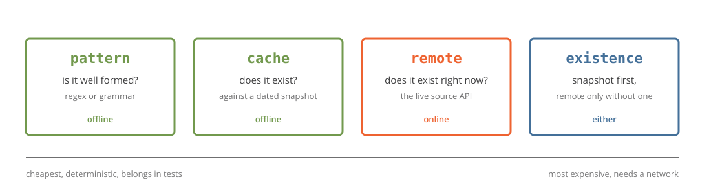

## The regex you already have

::: {.kicker}
Every app has one. None of them agree.
:::

```r
is_gene <- function(x) grepl("^[A-Z0-9-]+$", x)

is_gene(c("MLL", "KMT2A", "mondo:5148"))
#> [1]  TRUE  TRUE FALSE
```

::: {.walls .g2}
::: {.w1}
`MLL` passes

Retired in 2013. The gene is `KMT2A`.

shape is not existence
:::

::: {.w2}
`mondo:5148` fails

One uppercase and three zeros from a real id.

the user meant MONDO:0005148
:::
:::

::: {.payoff}
The regex knows the shape and nothing else.
:::

::: notes
ONE JOB: Every app re-implements this check, and every copy is wrong in its
own way.

SCRIPT: This is the function that lives in every bioinformatics app I have
written. A regex, written in a hurry. It lets through MLL, which was retired
over a decade ago, and it rejects mondo colon five one four eight, which is a
typo away from a real disease id. Shape is not existence, and a rejection
with no suggestion is a dead end for the user.

NUMBERS: 2 inputs wrong out of 3.

HONESTY: This is a lightly edited copy of code I wrote, not a strawman.

MEME: none.

CLOCK: leave by 0:45.

IF ASKED: "Why not just call biomaRt?" biomaRt answers what a gene is.
This answers whether the string is an identifier at all, offline, before you
spend a network call.
:::

## {.titlelogo} One gate, three languages

::: {.bignums}
::: {}
50

identifier sources
:::

::: {}
4

validation modes
:::

::: {}
3

languages, one corpus
:::
:::

::: {.pills}
[pattern]{.ok} [cache]{.ok} [remote]{.warm} [existence]{.alt}
[CRAN]{.mute} [PyPI]{.mute} [npm soon]{.mute}
:::

{.nostretch width="88%" fig-align="center"}

::: notes
ONE JOB: Four modes, from an offline regex up to a live existence check, and
the two offline ones are the ones you use most.

SCRIPT: biobouncer is one small API. Fifty sources: gene symbols, ontology
terms, variant syntax, accessions. Four modes. Pattern asks whether the string
is well formed. Cache asks whether it exists, against a dated snapshot, still
offline. Remote asks the live source. Existence tries the snapshot first. The
R, Python and JavaScript packages are tested against one shared corpus, so
they cannot drift apart on an edge case.

NUMBERS: 50 sources, 4 modes, 3 languages, version 0.2.0.

HONESTY: npm is not released yet. R is on CRAN, Python on PyPI.

MEME: none.

CLOCK: leave by 1:30.

IF ASKED: "How current is the snapshot?" The bundled HGNC one is dated
2026-07-07. biobouncer_pull() fetches a newer one and names it by date.
:::

## `check_id()`: one row per input

```r
check_id(c("MONDO:0005148", "mondo:5148", "GO:0006915"), "mondo")
#>   input         valid normalized    suggestion    source_db how
#>   MONDO:0005148 TRUE  MONDO:0005148 NA            mondo     pattern
#>   mondo:5148    FALSE NA            MONDO:0005148 mondo     pattern
#>   GO:0006915    FALSE NA            NA            mondo     pattern
```

::: {.cards}
::: {}
`valid`

Only ever TRUE, FALSE, or NA for a missing input.
:::

::: {.teal}
`suggestion`

What the user probably meant. Never invented.
:::

::: {.green}
`version`, `how`

Which snapshot and which mode gave this verdict.
:::
:::

::: {.payoff}
Same length, same order as the input. It sits next to your data frame.
:::

::: notes
ONE JOB: The result is a table that lines up with your input, and it carries
its own provenance.

SCRIPT: The core call returns one row per input, in input order. Valid is
true or false. Suggestion is the repair, when there is an honest one: the
lowercase id gets its canonical form, the GO term gets nothing because it is
not a MONDO id at all. And every row says which mode and which snapshot
version produced it, which is what you paste into a methods section.

NUMBERS: 9 columns; 1 row per input.

HONESTY: Suggestions in cache mode include fuzzy matches. Say so if the
question comes up; the tutorial shows how to tell them apart.

MEME: none.

CLOCK: leave by 2:15.

IF ASKED: "What about a missing value?" NA in, NA out. A blank cell is not a
failed id and is never dropped.
:::

## Repair a messy table

```r
df <- read.csv("data/associations.csv")
report_id(df$gene, "hgnc", how = "cache")
#> 7 values: 4 valid, 2 repairable, 1 invalid, 1 missing

df$gene <- repair_id(df$gene, "hgnc", how = "cache")
#> MLL -> KMT2A, CARS -> CARS1, notagene unchanged
```

::: {.flow}
::: {}
`report_id()`

One line summary per column.
:::

::: {}
`check_id()`

The rows behind the summary.
:::

::: {}
`repair_id()`

Substitute the fixable, leave the rest.
:::
:::

::: {.payoff}
Repair, do not drop. A user who typed MLL meant KMT2A.
:::

::: notes
ONE JOB: A retired symbol is repairable, and the repair comes from a dated
snapshot, not a guess.

SCRIPT: The demo data is a deliberately messy association table. Two retired
gene symbols, an obsolete GO term, a mis-cased disease id, one that does not
exist, one blank. report_id gives one line per column. repair_id substitutes
the fixable values and leaves the rest, so it drops straight into a mutate.
The row that says notagene stays notagene, because there is nothing honest to
replace it with.

NUMBERS: 7 rows, 2 repaired, 1 rejected, 1 missing.

HONESTY: The GO and MONDO snapshots bundled with the package are samples. HGNC
is the full dated one.

MEME: none.

CLOCK: leave by 3:00.

IF ASKED: "Does repair ever pick wrong?" Fuzzy suggestions can. Review them;
the tutorial gates on the retired-symbol map only.
:::

## Snapshots have dates

```r
biobouncer_snapshots()
#>   source version     n_ids location
#>   hgnc   2026-07-07  45019 bundled
#>   hgnc   sample         30 bundled
#>   mondo  sample         25 bundled

biobouncer_pull("mondo")      # once, online
check_id(x, "mondo", how = "cache", version = "2026-09-01")
```

::: {.walls .g2}
::: {.w3}
Pull once

A snapshot is a file with a date in its name.
:::

::: {.w4}
Check forever

Name the version. Re-run in a year, same verdict.
:::
:::

::: {.payoff}
The version string goes in your methods section.
:::

::: notes
ONE JOB: Existence checks are reproducible because the snapshot is pinned by
date.

SCRIPT: Cache mode is only as good as its snapshot, so the snapshot is a
first class thing. Pull one, it lands in a cache directory named by date.
Pass that version to check_id and the verdict is fixed. Somebody re-running
your pipeline next year gets the same answer, and the version string is right
there to cite.

NUMBERS: 45,019 HGNC symbols in the bundled snapshot.

HONESTY: The n_ids and dates on the slide are from the version I rendered
with; check biobouncer_snapshots() before quoting them.

MEME: none.

CLOCK: leave by 3:40.

IF ASKED: "How big are snapshots?" HGNC is under a megabyte compressed.
:::

## It drops into what you already use

::: {.pills .big}
[checkmate]{} [assertr]{.alt} [validate]{.alt} [pointblank]{.alt} [shinyvalidate]{.warm} [pandera]{.ok} [pydantic]{.ok}
:::

```r
assert_valid_id(ids, "hgnc", how = "cache")      # throws at the top of a function
is_hgnc <- id_predicate("hgnc", how = "cache")    # element-wise, for assertr
iv$add_rule("gene", sv_biobouncer("hgnc", how = "cache"))  # a Shiny input
```

::: {.payoff}
Every adapter calls the same classifier. None of them re-implements a rule.
:::

::: notes
ONE JOB: You do not change your validation stack; the same verdict arrives
through whichever door you already use.

SCRIPT: The adapters are thin. checkmate style check, assert and test.
An element-wise predicate that assertr, validate and pointblank all accept.
A shinyvalidate rule, so a Shiny input cannot fire a lookup on a malformed
id. In Python, pandera and pydantic. Every one of them calls the one
classifier, so they cannot disagree with each other.

NUMBERS: 5 R adapters, 2 Python adapters.

HONESTY: The adapters do not depend on those frameworks; they produce
something the framework consumes.

MEME: none.

CLOCK: leave by 4:20.

IF ASKED: "Does the Shiny rule slow typing?" Pattern mode is microseconds.
Cache mode is a hash lookup.
:::

## Same answer in Python

::: {.codepair}
::: {}
::: {.lang}
R
:::
```r
check_id(c("mondo:5148"), "mondo")
#> valid FALSE
#> suggestion MONDO:0005148

report_id(genes, "hgnc", how = "cache")
#> 2 repairable
```
:::

::: {}
::: {.lang}
Python
:::
```python
bb.check_id(["mondo:5148"], "mondo")
#> valid False
#> suggestion MONDO:0005148

bb.report(genes, "hgnc", how="cache")
#> 2 repairable
```
:::
:::

::: {.payoff}
One conformance corpus. Two implementations. Zero drift.
:::

::: notes
ONE JOB: The parity is tested, not promised.

SCRIPT: Same call, same verdict, same suggestion. That is not because the
code was written carefully twice; it is because both packages run against
one shared corpus of cases in CI, and a change that makes them disagree fails
the build. The tutorial runs the Python side through reticulate right after
the R side, on the same CSV.

NUMBERS: 1 corpus, 3 packages.

HONESTY: JavaScript is in the monorepo and tested too, but not on npm yet.

MEME: none.

CLOCK: leave by 5:00.

IF ASKED: "Which language is canonical?" Neither. The YAML source specs
are, and both are generated from them.
:::

## Start here

::: {.columns .smallish}
::: {.column width="50%"}
[Public]{.chip .public}

```r
install.packages("biobouncer")
```

```bash
pip install biobouncer
```

Docs: `samuelbharti.com/biobouncer`
:::

::: {.column width="50%"}
**Try it in a minute**

```r
library(biobouncer)
check_id("mondo:5148", "mondo")
repair_id(c("MLL", "CARS"), "hgnc", how = "cache")
```

Tutorial: `tutorials/biobouncer.qmd` in this repo.
:::
:::

::: notes
ONE JOB: Give them the one line to type tonight.

SCRIPT: It is on CRAN and PyPI. Install it, run check_id on the worst gene
list you have, and see what it finds.

NUMBERS: version 0.2.0.

HONESTY: Check that the docs domain resolves before showing the slide.

MEME: none.

CLOCK: done by 5:30.

IF ASKED: "Can I add a source?" Yes, sources are YAML specs in shared/,
and a pull request with a spec and a few corpus cases is the whole job.
:::
