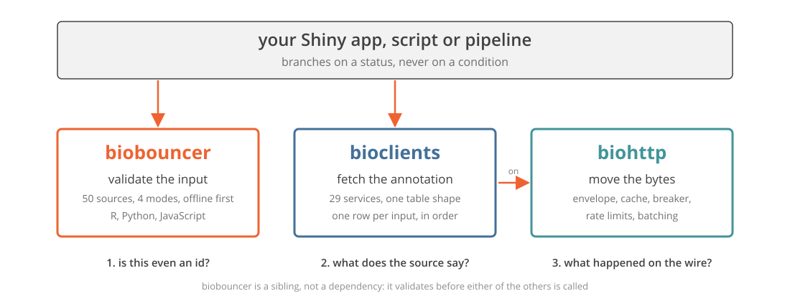
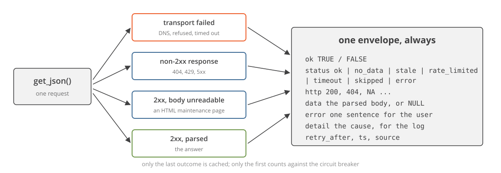
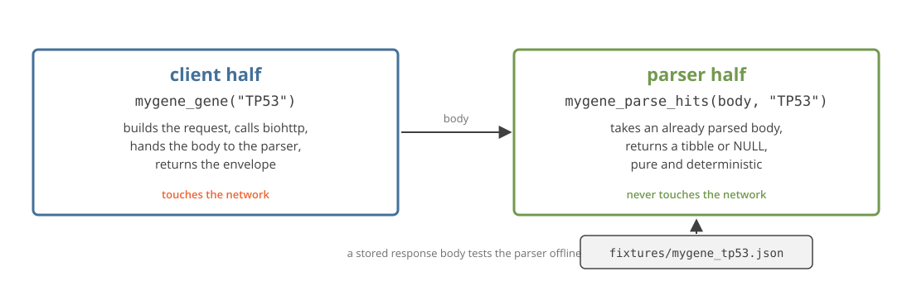
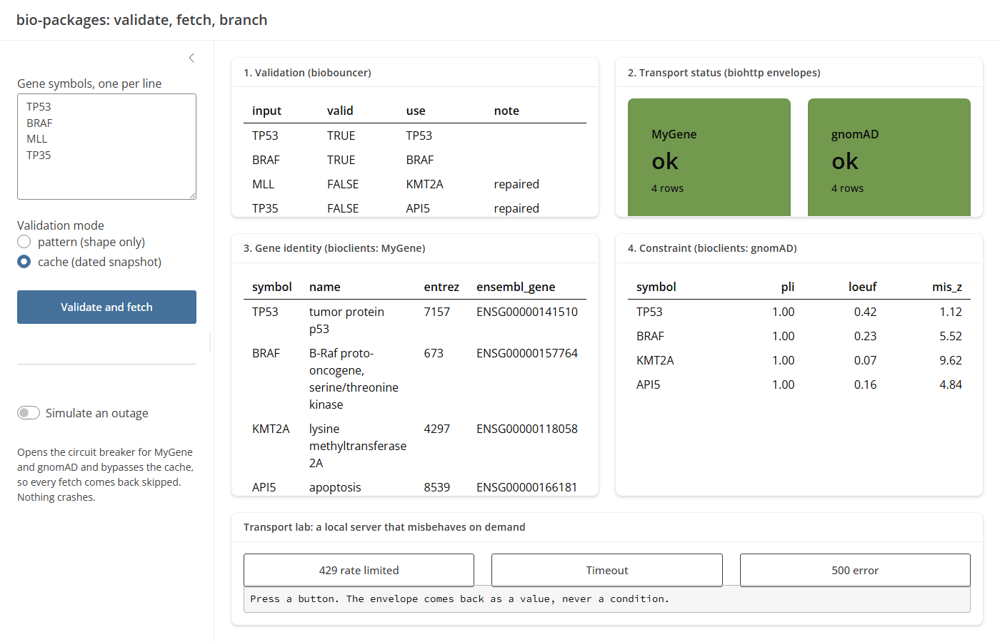
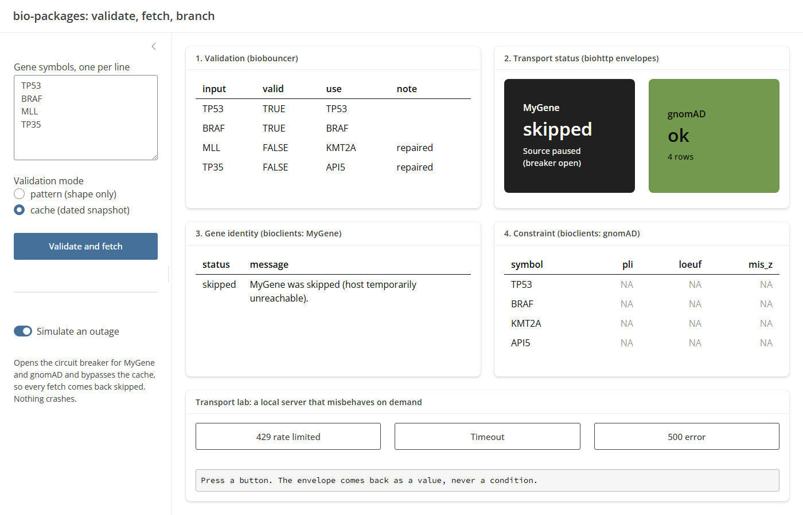

## Every app had the same two holes

::: {.kicker}
Seven life-science Shiny apps, one author, and the same code rewritten in each.
:::

::: {.bignums}
::: {}
7

apps
:::

::: {}
7

copies of "is this a gene?"
:::

::: {}
5

hand rolled API clients for the same service
:::

::: {.zero}
0

that agreed with each other
:::
:::

::: {.walls .g2}
::: {.w1}
Bad ids got through

`MLL` passed every regex. It was retired in 2013.
:::

::: {.w2}
Outages became bugs

A 503 and "no such gene" both returned NULL.
:::
:::

::: {.payoff}
That is not bad luck. That is a missing layer.
:::

::: notes
ONE JOB: The problem is repetition, and the copies disagreed in ways that
changed results.

SCRIPT: I build Shiny apps for biologists. Over the last year, seven of
them. Every one had a function that decided whether a string was a gene
symbol, and every one had a hand rolled client for the same handful of web
services. The copies did not agree. One app let a retired symbol through,
another resolved TTN to the wrong gene, and all of them showed "not found"
during an outage. Two holes, seven times.

NUMBERS: 7 apps, 7 validators, 5 clients for one service, 0 in agreement.

HONESTY: The apps are private and not deployed. Say "internal" and do not
name them.

MEME: none.

CLOCK: leave by 1:00.

IF ASKED: "Why not one shared utils file?" That is what this is, promoted
to packages with tests, so the next app cannot drift.
:::

## The tryCatch soup

```r
fetch_gene <- function(symbol) {
  url <- paste0("https://mygene.info/v3/query?q=", symbol)
  tryCatch(
    {
      body <- jsonlite::fromJSON(url)
      if (length(body$hits) == 0) return(NULL)
      body$hits[1, ]
    },
    error = function(e) NULL
  )
}
```

::: {.walls}
::: {.w1}
no such gene

NULL
:::

::: {.w2}
network down

NULL
:::

::: {.w3}
HTTP 503

NULL
:::

::: {.w4}
body was HTML

NULL
:::
:::

::: {.payoff}
NULL erases why. A cache of NULLs poisons itself.
:::

::: notes
ONE JOB: You cannot branch on a NULL, and the first cache anyone adds
makes it permanent.

SCRIPT: This is a lightly edited function from one of those apps. Four
different things produce that NULL. The UI says not found for all four.
Then someone adds a cache to make the app faster, the cache stores the
NULL, and the app says not found for an hour after the service comes back.

NUMBERS: 4 causes, 1 NULL.

HONESTY: I wrote this. It is not a strawman.

MEME: none.

CLOCK: leave by 1:50.

IF ASKED: "Just check the class of the error?" You can, in every call
site, in every app, and that is the soup.
:::

## Four walls

::: {.walls}
::: {.w1}
Bad ids get through

Shape is not existence. Nobody suggests a fix.

validate before you fetch
:::

::: {.w2}
Outages crash apps

Or worse, they look like empty results.

a failure is a value
:::

::: {.w3}
Rate limits look like bugs

429s retried in a tight loop, keys pasted into URLs.

limits belong in the client
:::

::: {.w4}
Nothing reproduces

The answer depends on the day, the network, and the cache.

pin, cache, record
:::
:::

::: {.payoff}
Each wall became a design rule, and each rule became a package.
:::

::: notes
ONE JOB: Name the four failures before naming the packages, so the packages
arrive as answers.

SCRIPT: Four walls. Bad identifiers get through, and when they are
rejected nobody suggests what the user meant. Outages crash apps, or they
look like empty results, which is worse. Rate limits look like bugs: a 429
retried in a loop, an API key pasted into a URL and into the log. And nothing
reproduces, because the answer depends on the day, the network, and whatever
was cached. Each of these became a rule, and each rule became a package.

NUMBERS: 4 walls.

HONESTY: None.

MEME: none.

CLOCK: leave by 2:40.

IF ASKED: "Is the fourth wall really a package's job?" Partly. The packages
make pinning and caching cheap; writing the version down is still yours.
:::

## Three packages, one line each

::: {.cards}
::: {.orange}
biobouncer

Is this even an identifier? 50 sources, 4 modes, offline first. R, Python, JavaScript.
:::

::: {.teal}
biohttp

Move the bytes and say what happened. One envelope, seven statuses, a cache that stores only successes.
:::

::: {}
bioclients

29 biological web services on biohttp. One table shape, one row per input.
:::
:::

::: {.pills}
[biobouncer 0.2.0: CRAN, PyPI]{.ok} [biohttp 0.1.2: CRAN]{.ok} [biohttp 0.1.3: r-universe]{.alt} [bioclients 0.1.1: r-universe]{.alt}
:::

::: {.payoff}
Validate, then transport, then fetch. Each one is separable, and none depends on Shiny.
:::

::: notes
ONE JOB: Which package answers which wall.

SCRIPT: Three packages. biobouncer answers wall one: is this string an
identifier, and if not, what did you mean. biohttp answers walls two and
three: every call returns a value, never a condition, and rate limits and
credentials are handled in the transport. bioclients is the 29 services
written once on top of it. Wall four is answered by all three together, and
that is the second half of this talk.

NUMBERS: 50 sources, 7 statuses, 29 services.

HONESTY: bioclients is not on CRAN. biohttp on CRAN is 0.1.2; some of what
I show is 0.1.3.

MEME: none.

CLOCK: leave by 3:30.

IF ASKED: "Why three packages and not one?" Because biohttp is useful to a
client for a service that has nothing to do with biology, and biobouncer is
useful in Python.
:::

## The family

{.nostretch width="86%" fig-align="center"}

::: notes
ONE JOB: The layers are ordered and separable.

SCRIPT: Your app or your script sits on top. It asks biobouncer whether an
input is worth a request. It asks bioclients for the annotation. bioclients
asks biohttp to move the bytes and tell it what happened. biobouncer is a
sibling, not a dependency of the other two; it runs before either is
called. And nothing in this picture imports Shiny, on purpose.

NUMBERS: 3 layers.

HONESTY: None.

MEME: none.

CLOCK: leave by 4:10.

IF ASKED: "Can I use bioclients without biobouncer?" Yes. You will send
requests for retired symbols and get NA rows back.
:::

## {.titlelogo} Is this even an identifier?

::: {.bignums}
::: {}
50

identifier sources
:::

::: {}
4

modes
:::

::: {}
3

languages, one corpus
:::
:::

```r
check_id(c("MONDO:0005148", "mondo:5148", "GO:0006915"), "mondo")
#>   input          valid  suggestion
#>   MONDO:0005148  TRUE   NA
#>   mondo:5148     FALSE  MONDO:0005148
#>   GO:0006915     FALSE  NA
```

::: {.pills}
[pattern: is it well formed?]{.ok} [cache: does it exist, in a dated snapshot?]{.ok} [remote: does it exist right now?]{.warm}
:::

::: {.payoff}
Offline by default. One row per input. The suggestion is what the user meant.
:::

::: notes
ONE JOB: Validation happens before a network call, offline by default, and
it says what the user meant.

SCRIPT: biobouncer is one small call. Fifty sources: gene symbols, ontology
terms, variant syntax, accessions. Pattern mode asks if the string is well
formed. Cache mode asks if it exists, against a snapshot with a date. Remote
asks the live source. The lowercase MONDO id is rejected with the canonical
form as a suggestion. The GO term is rejected because it is not a MONDO id
at all. And the R, Python and JavaScript packages are tested against one
corpus, so they cannot disagree.

NUMBERS: 50 sources, 4 modes, 3 languages, 0.2.0.

HONESTY: JavaScript is tested but not on npm yet.

MEME: none.

CLOCK: leave by 5:00.

IF ASKED: "Is this biomaRt?" No. biomaRt says what a gene is. This says
whether the string is an identifier, before you spend a call.
:::

## Repair, do not drop

```r
df$gene
#> [1] "TP53"  "MLL"  "CARS"  "BRCA2"  "EGFR"  "notagene"  NA

report_id(df$gene, "hgnc", how = "cache")
#> 4 valid, 2 repairable, 1 invalid, 1 missing

repair_id(df$gene, "hgnc", how = "cache")
#> [1] "TP53"  "KMT2A"  "CARS1"  "BRCA2"  "EGFR"  "notagene"  NA
```

::: {.flow}
::: {}
`MLL`

retired 2013, now `KMT2A`
:::

::: {}
`CARS`

renamed, now `CARS1`
:::

::: {}
`notagene`

unchanged. Nothing honest to replace it with.
:::

::: {}
`biobouncer_snapshots()`

HGNC 2026-07-07. Write it down.
:::
:::

::: {.payoff}
The repair comes from a dated snapshot, not from a guess.
:::

::: notes
ONE JOB: A retired symbol is repairable, the repair has a date, and a
nonsense token stays nonsense.

SCRIPT: The demo table is deliberately messy. report_id gives one line per
column. repair_id substitutes the fixable values: MLL becomes KMT2A, CARS
becomes CARS1. notagene stays notagene, because there is nothing honest to
put there. The snapshot those repairs came from has a date, and that date
goes in your methods section.

NUMBERS: 7 values, 2 repaired, 1 rejected.

HONESTY: Cache mode also offers fuzzy suggestions for near misses. Those
are for a human to review; the pipeline tutorial says so.

MEME: none.

CLOCK: leave by 5:50.

IF ASKED: "What about aliases?" An alias in the HGNC map is a suggestion.
A fuzzy near miss is also a suggestion, so review before auto-accepting.
:::

## {.titlelogo} A call returns a value

::: {.kicker}
It never raises. Branch on a status, not on a condition.
:::

{.nostretch width="88%" fig-align="center"}

::: notes
ONE JOB: One rule, and everything else in biohttp follows from it.

SCRIPT: biohttp has one rule. A call returns a value. A DNS failure, a
503, a 200 carrying a maintenance page, and a real answer all come back as
the same envelope. ok, status, http, data. An error sentence for the user
and a detail line for the log, kept apart so neither leaks into the wrong
place. There is no tryCatch at a call site because there is nothing to
catch.

NUMBERS: 4 outcomes, 1 envelope, 9 fields.

HONESTY: biohttp knows nothing about biology and never will.

MEME: none.

CLOCK: leave by 6:40.

IF ASKED: "Is it httr2?" It is built on httr2. httr2 is the engine;
biohttp is the policy: what is cached, what trips the breaker, what a
failure looks like.
:::

## Seven statuses

::: {.pills .big}
[ok]{.ok} [no_data]{.alt} [stale]{.alt} [rate_limited]{.warm} [timeout]{.warm} [skipped]{.mute} [error]{.warm}
:::

```r
switch(res$status,
  ok           = render_table(res$data),
  no_data      = "Nothing found for that query.",
  skipped      = "Source paused, try again shortly.",
  rate_limited = paste("Slow down, retry in", res$retry_after, "s"),
  res$error
)
```

::: {.cards}
::: {.teal}
`no_data`

An answer. The source was reached and has nothing.
:::

::: {}
`skipped`

Nothing was sent. Evidence about the host, not the query.
:::

::: {.orange}
`error`, `timeout`

The source did not answer. Say "try again", not "not found".
:::
:::

::: {.payoff}
The soup collapsed three of these into one NULL. The UI was lying during every outage.
:::

::: notes
ONE JOB: no_data and skipped are answers about different things, and the
UI must say different things for them.

SCRIPT: Seven statuses, best to worst. The whole call site is a switch.
The three people miss: no_data means the service said there is nothing
here, which is information. skipped means we did not ask, because the host
is paused. error and timeout mean the source did not answer. The hand
rolled client returned NULL for all three, and the UI said not found during
every outage.

NUMBERS: 7 statuses, 1 switch.

HONESTY: stale is a constructor for client code; the transport never emits
it on its own.

MEME: none.

CLOCK: leave by 7:30.

IF ASKED: "How do I test all seven?" One mocked response per status. The
tutorial produces all of them in one chunk, offline.
:::

## The breaker rule

::: {.verbatim}
"Only a transport failure counts against a host. Any HTTP response at all,
including a 500 and including a 200 whose body will not parse, proves the
host is reachable and clears the count."

[from the biohttp vignette]{.src}
:::

::: {.bignums}
::: {}
3

failures to open
:::

::: {}
120

seconds cooldown
:::

::: {.zero}
0

requests while open
:::
:::

::: {.payoff}
A 503 proves the host is up. A hand rolled breaker that counts it turns a partial outage into a total one.
:::

::: notes
ONE JOB: A 500 must not trip the breaker, and this is the rule people get
wrong.

SCRIPT: After three consecutive transport failures, a host is skipped for
two minutes and every call comes back skipped in microseconds. What counts
as a failure is the whole design. Only a transport failure: DNS, refused,
timed out. A 500 proves the host is reachable. A service returning error
pages is broken, but it is up, and taking it out of rotation turns a partial
outage into a total one. It heals itself.

NUMBERS: 3 failures, 120 seconds, both configurable.

HONESTY: None.

MEME: none.

CLOCK: leave by 8:15.

IF ASKED: "What about a 429?" A 429 clears the failure count, and 0.1.3
records the Retry-After so the next dispatch waits instead of hammering.
:::

## {.titlelogo} 29 services, two halves each

::: {.bignums}
::: {}
29

services
:::

::: {}
134

exported functions
:::

::: {}
57

stored fixtures
:::

::: {.zero}
0

Shiny dependencies
:::
:::

{.nostretch width="80%" fig-align="center"}

::: {.payoff}
The parser is pure and fixture tested. The suite runs without a network.
:::

::: notes
ONE JOB: Twenty-nine clients with one envelope, and the half you test never
touches the network.

SCRIPT: bioclients is those hand rolled clients written once. MyGene,
gnomAD, ClinVar, Open Targets, UniProt, Reactome, twenty-nine in all. Every
module is two halves. The client half builds the request and calls biohttp.
The parser half takes a parsed body and returns a tibble, and it is pure, so
it is tested against fifty-seven stored response bodies. The whole suite
runs offline. Batch functions return one row per input in input order, so a
miss is an NA row in place, never a shifted table.

NUMBERS: 29 services, 134 exports, 57 fixtures.

HONESTY: Not on CRAN. The pkg-r suffix in the pak call is mandatory.

MEME: none.

CLOCK: leave by 9:10.

IF ASKED: "Rate limits?" Hard coded per client where they were verified:
ClinVar 3 per second or 10 with a key, VEP 1 per second, and the key goes
through secret_query so it never reaches the cache key or a log.
:::

## Reproducible by construction

::: {.walls}
::: {.w1}
offline modes

pattern and cache never touch the network

`how = "cache"`
:::

::: {.w2}
dated snapshots

the version is a string you can cite

`version = "2026-07-07"`
:::

::: {.w3}
success-only disk cache

fixed salt, long TTL, committed to the repo

`BIOHTTP_CACHE_DIR`
:::

::: {.w4}
statuses, not exceptions

an outage is a column value in the output

`res$status`
:::
:::

::: {.payoff}
Four mechanisms. Each one is a file or a string you can commit.
:::

::: notes
ONE JOB: Reproducibility here is not discipline, it is four mechanisms,
each of which leaves a file behind.

SCRIPT: Wall four. Four mechanisms. The validation modes you use most are
offline and deterministic, so they belong in tests. The snapshot has a date,
so the verdict can be re-run. The transport cache stores only successes,
keyed on the exact request, and with the disk tier and a fixed salt it is a
directory you can commit. This whole talk runs from one. And an outage is a
status in a column, so the output of a run that hit an outage is still a
table, and it says which rows were affected.

NUMBERS: 4 mechanisms.

HONESTY: The committed cache uses a one year TTL and a fixed salt. That is
a demo setting; production uses the defaults.

MEME: none.

CLOCK: leave by 10:00.

IF ASKED: "Is a committed cache a security problem?" It holds public API
responses only. Credentials never enter the cache key.
:::

## Pipeline: eleven symbols, one table

```r
genes <- read.csv("data/genes.csv")          # TP53 BRAF NF1 ... MLL CARS TP53_HUMAN NA
chk   <- check_id(genes$symbol, "hgnc", how = "cache")
clean <- ifelse(chk$valid, chk$normalized, chk$suggestion)   # 9 survive
clean <- clean[!is.na(clean)]

ids   <- mygene_genes(clean)                 # one POST, 9 rows
cons  <- gnomad_constraints(clean)           # one GraphQL request, 9 rows
ot    <- lapply(ids$data$ensembl_gene,
                \(id) opentargets_gene_diseases(id, size = 3))

genes |>
  left_join(ids$data,  by = c(clean = "symbol")) |>
  left_join(cons$data, by = c(clean = "symbol"))
```

::: {.payoff}
The whole chain fits on one slide because none of it is error handling.
:::

::: notes
ONE JOB: The pipeline fits on a slide because there is no error handling
in it.

SCRIPT: Eleven symbols in. Two retired, one UniProt entry name pasted in
the wrong column, one blank, one mixed case, one that trips the TTN trap.
The gate repairs MLL and CARS and stops the other two before a request is
spent on them. One POST resolves nine ids. One GraphQL request gets nine
constraint scores. Nine single calls to Open Targets. Then a join back onto
the original eleven rows, in the original order, with the rejected rows
still there and a reason next to them.

NUMBERS: 11 in, 9 fetched, 2 stopped at the gate, 11 requests on the first
run.

HONESTY: The numbers are from tutorials/pipeline.qmd as rendered. Re-check
after re-warming.

MEME: none.

CLOCK: leave by 11:00.

IF ASKED: "Where is the throttle?" gnomAD and MyGene have none documented
at this scale. ClinVar and VEP carry theirs as defaults.
:::

## Second run

::: {.bignums}
::: {}
11

requests, first run
:::

::: {.zero}
0

requests, second run
:::

::: {}
0.05 s

second run, all three services
:::
:::

```r
transport_stats()
#> [1] host dispatched retried rate_limited
#> <0 rows>

identical(cons$data, cons2$data)
#> [1] TRUE
```

::: {.payoff}
Cache hit evidence is a number, not a feeling.
:::

::: notes
ONE JOB: The second run is free and identical, and you can prove it with a
counter.

SCRIPT: Run the same pipeline again. transport_stats counts what the
batched path actually sent, per host. Zero rows. The tables are identical.
The elapsed time is a few hundredths of a second for all three services.
That is the cache this repo commits, and it is why every tutorial in this
talk renders with the Wi-Fi off.

NUMBERS: 11 first run, 0 second run, 0.05 s. From tutorials/pipeline.qmd.

HONESTY: transport_stats counts only batched calls. The nine Open Targets
calls are single path and do not appear, which is why it says zero rows
rather than zero dispatched.

MEME: none.

CLOCK: leave by 11:45.

IF ASKED: "What if the service changed its answer?" Then re-warm. The
cache is a record of what the service said on a date, which is the point.
:::

## Pull the plug

::: {.bignums}
::: {}
3

transport failures recorded
:::

::: {}
1

status: skipped
:::

::: {.zero}
0

crashes
:::
:::

```r
for (i in 1:3) breaker_record("mygene.info", reachable = FALSE)

down <- mygene_genes(c(clean, "ABL1"))
down$status
#> [1] "skipped"
down$error
#> [1] "MyGene was skipped (host temporarily unreachable)."
```

::: {.payoff}
The table still builds. The MyGene columns are NA and a status column says why.
:::

::: notes
ONE JOB: Degrade, do not crash, and say why in the output.

SCRIPT: Now MyGene goes down. In the tutorial I trip the breaker by hand,
three transport failures recorded against the host, which is what three
refused connections would do on their own. The next call sends nothing and
comes back skipped with a sentence for the user. The pipeline still builds
its table. The MyGene columns are NA for that run, and the status column
says why, so the person reading the output knows it was the host and not
their gene list.

NUMBERS: 3 failures, 1 skipped, 0 crashes.

HONESTY: This is a simulated outage. Say so. The request also has to be
one the cache does not hold, which is why ABL1 is added.

MEME: none.

CLOCK: leave by 12:30.

IF ASKED: "How does it recover?" The cooldown expires on its own. Nothing
to reset in production.
:::

## The Shiny app

::: {.shot}

:::

::: notes
ONE JOB: Three packages, one small app, and the status strip is driven by
envelopes.

SCRIPT: The same three packages in a Shiny app, under two hundred lines.
Paste symbols, pick a validation mode. The first card is biobouncer: valid,
repaired, or rejected, per row. The strip is one value box per source,
coloured by envelope status. Below it, the MyGene and gnomAD tables. There
is no tryCatch anywhere in the server. A shinyvalidate rule from biobouncer
sits on the input, so a malformed id never fires a request.

NUMBERS: about 170 lines, 0 tryCatch.

HONESTY: Neither biohttp nor bioclients imports Shiny. The app is the
caller, which is the design.

MEME: none.

CLOCK: leave by 13:20.

IF ASKED: "Can I run it?" Yes, from the repo, offline, because the default
input is in the committed cache.
:::

## Same app, the network gone

::: {.shot}

:::

::: notes
ONE JOB: The skipped card is the whole talk in one pixel.

SCRIPT: Flip the outage switch. It opens the breaker for both hosts and
bypasses the cache, so every fetch reaches the breaker. Validation still
works, because biobouncer is offline. The two source cards turn dark and say
skipped, source paused. The tables say why. Nothing crashed, nothing
pretended the genes were not found.

NUMBERS: 2 hosts paused, 0 requests sent.

HONESTY: The switch trips the breaker by hand; it is not a real outage.

MEME: none.

CLOCK: leave by 14:00.

IF ASKED: "What does the transport lab do?" A local webfakes server that
answers 429, times out, or 500s on demand, so the envelope for each can be
shown live without a real host misbehaving.
:::

## What is on CRAN and what is not

::: {.columns .smallish}
::: {.column width="33%"}
[CRAN, PyPI]{.chip .public}

**biobouncer 0.2.0**

```r
install.packages("biobouncer")
```

```bash
pip install biobouncer
```
:::

::: {.column width="33%"}
[CRAN 0.1.2]{.chip .public} [r-universe 0.1.3]{.chip .internal}

**biohttp**

```r
install.packages("biohttp")
```

0.1.3 adds `retry_after`, batched retry, `transport_stats()`.
:::

::: {.column width="33%"}
[r-universe]{.chip .wip}

**bioclients 0.1.1**

```r
pak::pak(
  "samuelbharti/bioclients/pkg-r")
```

The `/pkg-r` suffix is required.
:::
:::

::: {.payoff}
Say the versions once, out loud, and nobody installs the wrong one.
:::

::: notes
ONE JOB: State the three versions and where each one lives.

SCRIPT: biobouncer is on CRAN and PyPI. biohttp is on CRAN at 0.1.2; the
retry-after handling and transport_stats I showed are 0.1.3, on r-universe
today. bioclients is on r-universe and GitHub, not CRAN yet, and the package
lives in a subfolder, so the pak call needs the suffix.

NUMBERS: 0.2.0, 0.1.2 and 0.1.3, 0.1.1.

HONESTY: Do not promise dates for either CRAN submission.

MEME: none.

CLOCK: leave by 14:40.

IF ASKED: "Zenodo?" All three have concept DOIs; they are in each
CITATION.cff.
:::

## Start here

::: {.columns .smallish}
::: {.column width="50%"}
**Tonight**

```r
install.packages(c("biobouncer", "biohttp"))
install.packages("bioclients",
  repos = "https://samuelbharti.r-universe.dev")

library(biobouncer); library(bioclients)
clean <- repair_id(c("MLL", "TP53", "notagene"), "hgnc", how = "cache")
mygene_genes(clean)$status
```
:::

::: {.column width="50%"}
**This talk**

- Four tutorials, one per package and one pipeline, all render offline
- A Shiny app under 200 lines
- A committed transport cache and the scripts that warm and verify it

Docs hub: `samuelbharti.com/biobouncer`, `/biohttp`, `/bioclients`
:::
:::

::: {.payoff}
Validate, then fetch, then branch on what came back.
:::

::: notes
ONE JOB: Give them one thing to type tonight and one place to look.

SCRIPT: Three lines to install, three lines to try. The repo behind this
talk has four tutorials and the app, and every one of them runs with the
network off, because of the packages it is about. Validate, then fetch, then
branch on what came back.

NUMBERS: 3 packages, 4 tutorials, 1 app.

HONESTY: Check the docs domain resolves before showing the slide.

MEME: none.

CLOCK: leave by 15:30, which leaves time for questions.

IF ASKED: "Python for the other two?" No. biobouncer is the cross language
one; biohttp and bioclients are R on httr2.
:::

## Questions

::: {.logorow}


:::

::: notes
ONE JOB: none.

SCRIPT: Thank you.

NUMBERS: none.

HONESTY: none.

MEME: none.

CLOCK: done.

IF ASKED: see the per-package decks in this repo for the deeper dive on
each one.
:::
